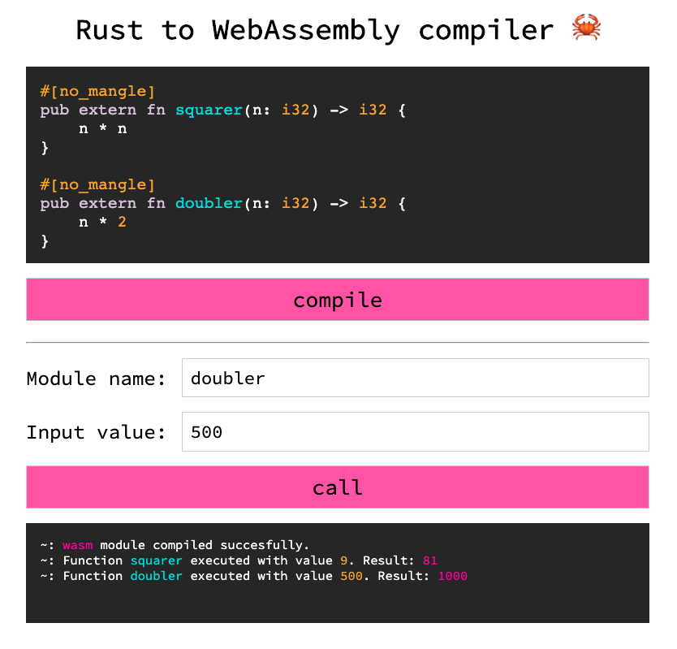

# Rust to WebAssembly compiler 🦀

This project is kind of 'proof of concept' for dynamic compiling to WebAssembly modules. Currently it would only work for simple functions.

Note on `#[no_mangle]`: this option helps to preserve original function name when called from wasm module. Otherwise it would *mangle* it.

## Prerequisites

You'll have to install [rustup](https://rustup.rs/) on your local machine. You can read [Hasan Yousef's](https://github.com/hajsf) excellent [blogpost](https://dev.to/h_ajsf/simple-rust--wasm-example-5b1m) to get basic idea of how to compile Rust to wasm locally.

You'll also need [Node.js](https://nodejs.org/en/) installed on your machine.

## Run

Simply run `node app.js` in the root directory. Open `localhost:3000` in your browser (Chrome preferably) and you're good to go.

## Dependencies

* [highlight.js](https://github.com/highlightjs/highlight.js) for syntax highlighting.
* [arrive](https://github.com/uzairfarooq/arrive) to make syntax highlighting dynamic.
* [express](https://expressjs.com/en/4x/api.html) to bootstrap the server.

### P.S.

I use `arrive` library in an awkward way, don't feel too cringy about that.